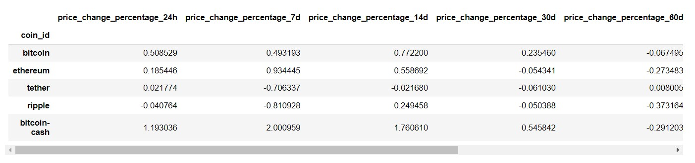

# CryptoClustering Challenge
In this challenge, I used Python and unsupervised learning to predict if cryptocurrencies are affected by 24-hour or 7 day price changes.

### Preparing the Data
Using the `StandardScaler()` module from `scikit-learn`, I normalized the data from the provided CSV file. I then created a DataFrame with the scaled data and set the "coin_id" index from the original DataFrame, as the index for the new DataFrame as shown below.

### Finding the Best Value for K Using the Original Scaled Data
Using the elbow method to find the best value for `k` , I created a list with a number of K values from 1 to 11 and an empty list to store the inertia values.
I then used a `for` loop to compute the inertia with each possible value of `k` and stored the data in a dictionary which I used to plot the elbow curve. Using a line graph, I was able to plot the inertia vluaes compupted with the different values of `k` to visually identify the optimal value for `k`. **The optimal value for `k` is 4.**

### Cluster Crypotcurrencies with K-means Using the Original Scaled Data
After finding the optinal value for `k` using the elbow method, I took the following steps:
initialized the K-means model, fit the K-means model using the orginal scaled DataFrameFrame, and predicted the clusters to group the cryptocurrencies using the original scaled DataFrame.
From here, I created a copy of the orginal data and added a new column with the predicted clusters. 

