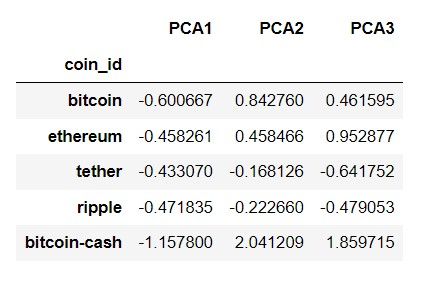

# CryptoClustering Challenge
In this challenge, I used Python and unsupervised learning to predict if cryptocurrencies are affected by 24-hour or 7 day price changes.

### Preparing the Data
Using the `StandardScaler()` module from `scikit-learn`, I normalized the data from the provided CSV file. I then created a DataFrame with the scaled data and set the "coin_id" index from the original DataFrame, as the index for the new DataFrame as shown below.

### Finding the Best Value for K Using the Original Scaled Data
Using the elbow method to find the best value for `k` , I created a list with a number of K values from 1 to 11 and an empty list to store the inertia values.
I then used a `for` loop to compute the inertia with each possible value of `k` and stored the data in a dictionary which I used to plot the elbow curve. Using a line graph, I was able to plot the inertia vluaes compupted with the different values of `k` to visually identify the optimal value for `k`. **The optimal value for `k` is 4.**

### Cluster Crypotcurrencies with K-means Using the Original Scaled Data
After finding the optinal value for `k` using the elbow method, I took the following steps:
initialized the K-means model, fit the K-means model using the orginal scaled DataFrameFrame, and predicted the clusters to group the cryptocurrencies using the original scaled DataFrame.
From here, I created a copy of the orginal data and added a new column with the predicted clusters. 

  

Using this data, I created a scatter plot using hvPlot where the x-axis represents the price change percentage ove4 24 hours and the y-axis as the price change percentage over 7 days.
color on the graph points are found using K-means and if you hover over the scatter plot in the jupter notebook file, each point is labeled with details including the crypto currency type.

### Optimize Clusters with Principal Component Analysis (PCA)
Using the original scaled DataFrame, I peformed a PCA and reduced the features to three principal components. The explained variance calculation was used to determine how much information can be attributed to each principal component. The total explained variance of the three principal components was .88 or 88%.

I created a new DataFrame with the PCA data and set the "coin_id" index from the original DataFrame as the index to the new DataFrame. The first 5 rows are shown below. 

From here I begin working to find the best Value for K using the PCA data.

### Finding the Best Value for K Using the PCA Data
using the elbow method on the PCA data to find best value for `k`, I created a list with the number of K-values from 1-11 and repeated the process similar to the last elbow curve listed above.
When I plotted a line chart with all of the inertial values computed with the different values of `k`, I was able to determine that this elbow curve indicated that 4 was the best value for `k`.

### Cluster Crypotcurrencies with K-means Using the PCA Data
Using the best value for `k` as determined by the elbow method, I begin the process to cluster the cryptocurrencies on the PCA data. These steps include:
Initialize the K-means model with the best value for `k`.
Fit the K-means model using the PCA data.
Predict the clusters to group the cryptocurrencies using the PCA data.
Create a copy of the DataFrame with the PCA data and add a new column to store the predicted clusters.
Create a scatter plot using hvPlot to show clusters.

### Visualize and Compare the Results
To visualize and compare the results, I created a composite plot by using hvPlot to compare the elbow curve created from the original data and the one created using the PCA data. I then created another componsite plot using hvPlot to compare the cryptocurrency clusters that resulted from using the original data and those that resulted from the PCA data. Sadly, I'm not having successing exporting this image using the recommendations in the documentation. I will continue to try to get these side by side comparisons, in the meantime, they show the exact same images as shared above and in my jupyter notebook file.

In comparing the results, both methods used provided me with the same `k` value of 4 when I used the elbow method. In comparing clusters, the PCA clusters were more dense and concetrated than scaling and using K-means alone. 

-----------------------------------------------------------------------------------------------------------

references:

Resources and Challenges provided by MSU Data Bootcamp.

https://holoviews.org/user_guide/Composing_Elements.html

https://pandas.pydata.org/docs/reference/general_functions.html

Lindgren, Isabella (2020, Apr 24) Dealing with Highly Dimensional Data using Principal Component Analysis (PCA). Medium. https://towardsdatascience.com/dealing-with-highly-dimensional-data-using-principal-component-analysis-pca-fea1ca817fe6#:~:text=The%20explained%20variance%20ratio%20is,or%2080%25%20to%20avoid%20overfitting.

